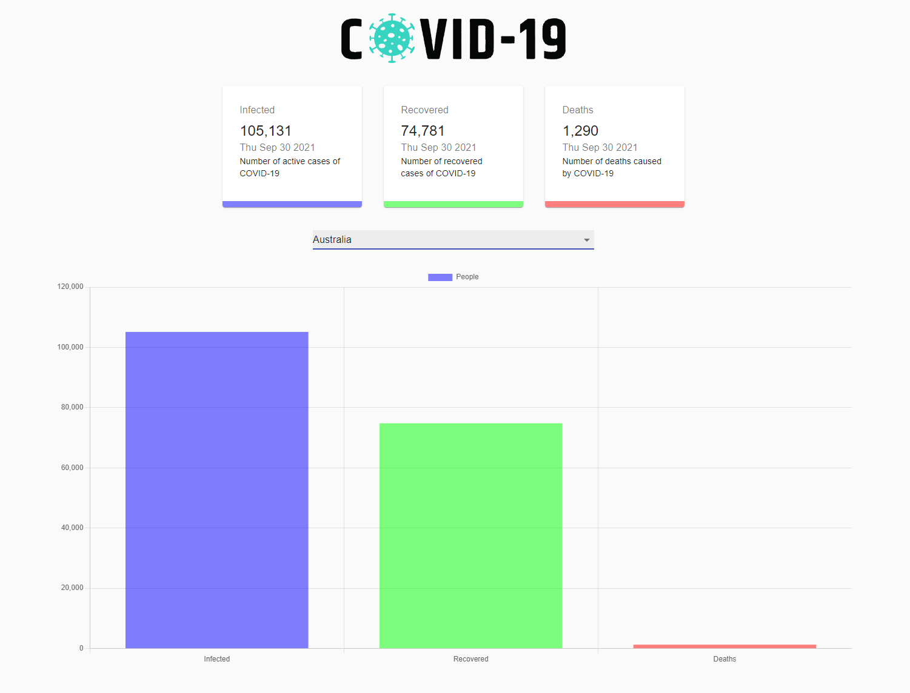

# Covid 19 Tracker

This is a Covid 19 Tracker Built using React. 
Allow users to see live global covid 19 information aswell as contry specific information.

## Table of contents

- [Overview](#overview)
  - [Screenshot](#screenshot)
  - [Links](#links)
- [My process](#my-process)
  - [Built with](#built-with)
  - [What I learned](#what-i-learned)
  - [Continued development](#continued-development)
  - [Useful resources](#useful-resources)
- [Author](#author)
- [Acknowledgments](#acknowledgments)

## Overview

### Screenshot

### Links

- Live Site URL: (https://covid19-tracker-67.netlify.app/)

## My process

### Built with

- Semantic HTML5 markup
- CSS custom properties
- Flexbox
- CSS Grid
- Responsive Design
- [React](https://reactjs.org/) - JS library
- [Next.js](https://nextjs.org/) - React framework
- [Create React App](https://github.com/facebook/create-react-app) - Create React App
- [react-chartjs-2](https://www.npmjs.com/package/react-chartjs-2) - React Wrapper for Chart.js

Api
- Api Request made using Axios
- Data from [Open Disease Data Api](https://disease.sh/)

### What I learned

I learned how to make api request using Axios.
I learned how to plot data using React Charts Library

### Useful resources

- [Build a COVID-19 Tracker Application](https://www.youtube.com/watch?v=khJlrj3Y6Ls) - This helped video tutorial helped me build the application.
- [Disease.sh Api](https://disease.sh/) - This is an website that provides live covid 19 data.

## Author

- Website - [Add your name here](https://www.your-site.com)
- Frontend Mentor - [@yourusername](https://www.frontendmentor.io/profile/yourusername)
- Twitter - [@yourusername](https://www.twitter.com/yourusername)

## Acknowledgments

I would live to acknowledge the youtube video made by JavaScript Mastery 'Build a COVID-19 Tracker Application" that helped me a lot when I set out to build this website. The video provided me with the overal design and layout.
